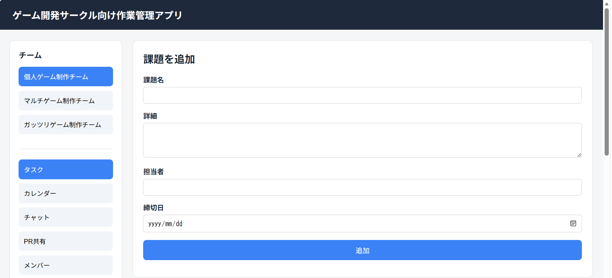
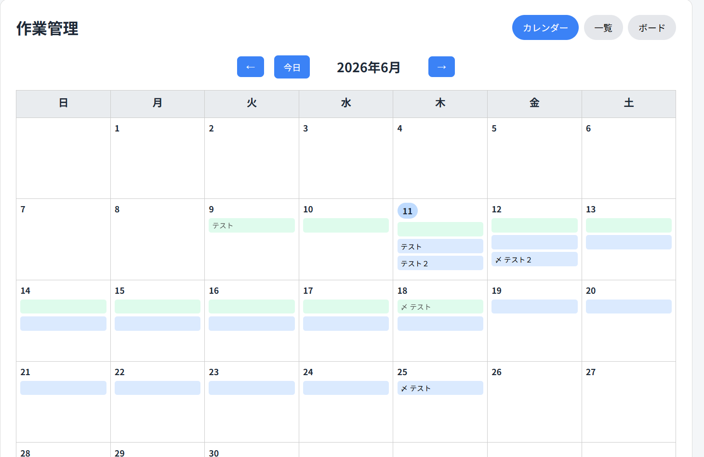
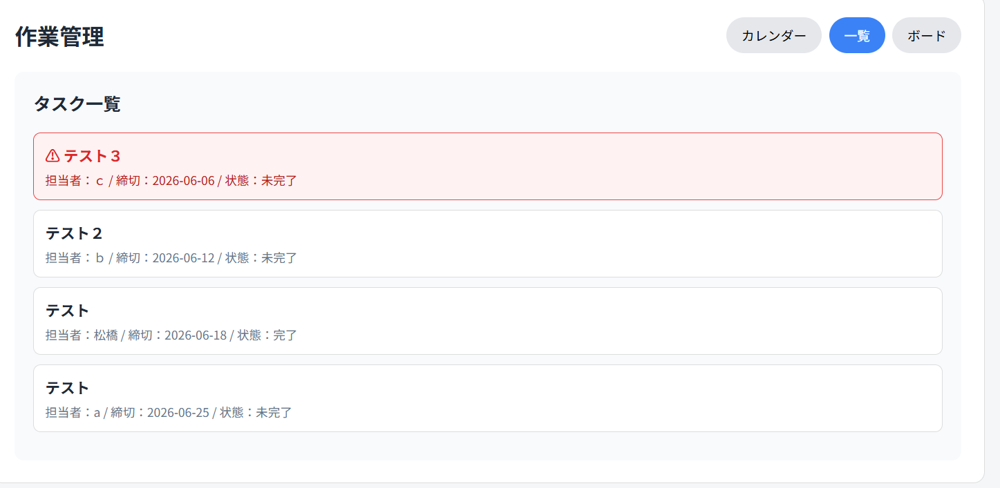
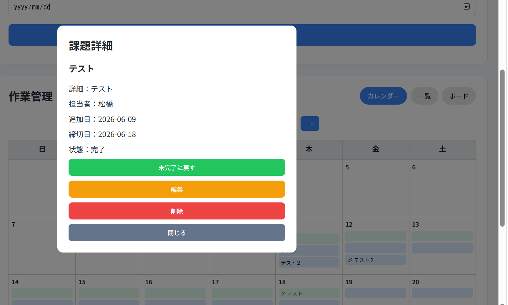
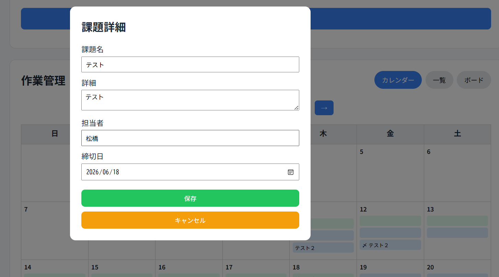

# ゲーム開発サークル向け作業管理Webアプリ

## 概要

現在所属しているゲーム開発サークルでの利用を想定した、作業管理Webアプリです。

ゲーム制作では、プログラム、デザイン、サウンド、シナリオ、企画など複数の担当者が同時に作業を進めます。そのため、「誰が・何を・いつまでに・どの状態で進めているか」を分かりやすく共有することが重要です。

本アプリでは、タスクの追加、カレンダー表示、一覧表示、詳細確認、完了管理、編集、削除を行えるようにし、チーム内で作業状況を確認しやすくすることを目的としています。

将来的には、タスクごとのコメント機能、GitHubのPull Request共有、画像・音声ファイルの添付機能を追加し、ゲーム制作に必要な情報共有をアプリ内で完結できるようにする予定です。

---

## 開発背景

ゲーム開発サークルでは、複数人で1つの作品を制作するため、作業内容や進捗の共有が重要になります。

しかし、作業が増えると以下のような課題が発生します。

* 誰がどの作業を担当しているか分かりにくい
* 締切や進捗状況を把握しにくい
* 今日やるべき作業を確認しにくい
* GitHubのPull Requestの確認依頼が流れやすい
* 画像、音声、修正内容などの制作資料をまとめて管理しにくい
* チームごとの作業状況を分けて確認しにくい

これらの課題を解決するため、ゲーム制作チーム向けの作業管理アプリを開発しています。

---

## 想定している利用場面

複数のゲーム制作チームが活動しているサークル内での利用を想定しています。

例：

* 個人ゲーム制作チーム
* マルチゲーム制作チーム
* ガッツリゲーム制作チーム

各チームごとにタスクを登録し、担当者、締切、進捗状況を確認できるようにする予定です。

---

## 使用技術

### 現在使用している技術

* HTML
* CSS
* JavaScript
* localStorage

### 今後使用予定の技術

* React
* Ruby on Rails
* PostgreSQL
* GitHub API

---

## 実装済み機能

### 1. タスク追加機能

タスク名、詳細、担当者、締切日を入力してタスクを追加できます。



タスク名と締切日は必須項目としており、未入力の場合はエラーメッセージを表示します。

```js
if (title === "" || deadline === "") {
  errorMessage.textContent = "課題名と締切日は必須です";
  return;
}
```

入力された内容は、以下のようなオブジェクトとして管理しています。

```js
const task = {
  id: Date.now(),
  title: title,
  description: description,
  assignee: assignee,
  createdAt: getTodayString(),
  deadline: deadline,
  completed: false
};
```

---

### 2. localStorageによるデータ保存

追加したタスクはlocalStorageに保存しています。

```js
function saveTasks() {
  localStorage.setItem("tasks", JSON.stringify(tasks));
}
```

localStorageには配列やオブジェクトをそのまま保存できないため、`JSON.stringify()`で文字列に変換して保存しています。

ページ読み込み時には、保存されたJSON文字列を`JSON.parse()`で配列に戻しています。

```js
let tasks = JSON.parse(localStorage.getItem("tasks")) || [];
```

これにより、ページを更新してもタスクが消えないようにしています。

---

### 3. カレンダー表示機能

タスクの追加日から締切日までをカレンダー上にバーとして表示します。



表示判定には、`YYYY-MM-DD`形式の日付文字列を比較しています。

```js
if (dateString >= task.createdAt && dateString <= task.deadline) {
  // タスクを表示
}
```

開始日にはタスク名、締切日には「〆」を表示し、中間日はバーのみを表示するようにしています。

```js
if (dateString === task.createdAt && dateString === task.deadline) {
  label = task.title + " 〆";
} else if (dateString === task.createdAt) {
  label = task.title;
} else if (dateString === task.deadline) {
  label = "〆 " + task.title;
}
```

---

### 4. タスク一覧表示機能

カレンダー表示だけでなく、タスクを一覧で確認できる機能を追加しました。



一覧では、担当者、締切日、完了状態を表示します。
また、締切日が近い順に並び替えることで、優先して確認すべき作業を分かりやすくしています。

```js
tasks
  .slice()
  .sort(function (a, b) {
    return a.deadline.localeCompare(b.deadline);
  })
  .forEach(function (task) {
    // タスクを一覧表示
  });
```

`slice()`を使うことで、元の`tasks`配列を直接並び替えず、コピーした配列を並び替えるようにしています。

---

### 5. 期限切れタスクの強調表示

締切日が今日より前で、まだ完了していないタスクは、一覧画面で赤く表示するようにしました。

```js
const isExpired = task.deadline < todayString && !task.completed;

if (isExpired) {
  item.classList.add("expired");
}
```

これにより、対応が遅れているタスクに気づきやすくしています。

---

### 6. 表示切り替えタブ

作業管理エリアに、表示切り替え用のタブを追加しました。

現在は以下の3つの表示を用意しています。

* カレンダー
* 一覧
* ボード

ボード表示は今後実装予定ですが、タブ切り替えの土台を先に作成しました。

```js
function switchView(viewName) {
  calendarArea.classList.add("hidden");
  listArea.classList.add("hidden");
  boardArea.classList.add("hidden");

  calendarTab.classList.remove("active");
  listTab.classList.remove("active");
  boardTab.classList.remove("active");

  if (viewName === "calendar") {
    calendarArea.classList.remove("hidden");
    calendarTab.classList.add("active");
    renderCalendar();
  }

  if (viewName === "list") {
    listArea.classList.remove("hidden");
    listTab.classList.add("active");
    renderTaskList();
  }

  if (viewName === "board") {
    boardArea.classList.remove("hidden");
    boardTab.classList.add("active");
  }
}
```

---

### 7. タスク詳細モーダル機能

カレンダー上のタスクバーや一覧のタスクをクリックすると、モーダルで詳細を確認できます。



以前は右側の詳細パネルに表示していましたが、カレンダーを広く使うために右パネルを廃止し、詳細表示をモーダル化しました。

表示する情報は以下です。

* タスク名
* 詳細
* 担当者
* 追加日
* 締切日
* 状態

```js
taskBtn.addEventListener("click", function () {
  renderTaskDetail(task);
});
```

---

### 8. 完了・未完了切り替え機能

タスクの完了状態を切り替えることができます。

```js
task.completed = !task.completed;
```

状態を変更した後は、localStorageへ保存し、カレンダー、一覧、詳細モーダルを再描画しています。

```js
saveTasks();
renderCalendar();
renderTaskList();
renderTaskDetail(task);
```

これにより、完了状態の変更が画面全体に反映されるようにしています。

---

### 9. 編集モーダル機能

タスクの編集は、画面中央に表示されるモーダル画面で行います。



編集ボタンを押すと、現在のタスク情報が入力欄に表示されます。

```js
titleEdit.value = task.title;
descriptionEdit.value = task.description;
assigneeEdit.value = task.assignee || "";
deadlineEdit.value = task.deadline;
```

保存ボタンを押すと、入力内容をタスクオブジェクトへ反映し、localStorageに保存します。

```js
task.title = titleEdit.value;
task.description = descriptionEdit.value;
task.assignee = assigneeEdit.value;
task.deadline = deadlineEdit.value;

saveTasks();
renderCalendar();
renderTaskList();
renderTaskDetail(task);
closeModal();
```

モーダルを使うことで、詳細確認や編集操作を画面中央で分かりやすく行えるようにしました。

---

### 10. 削除機能

削除ボタンを押すと確認ダイアログを表示し、OKを押した場合のみ削除します。

```js
const ok = confirm("この課題を削除しますか？");
if (!ok) return;
```

削除処理では、`filter()`を使って削除対象以外のタスクだけを残しています。

```js
tasks = tasks.filter(function (t) {
  return t.id !== task.id;
});
```

---

## UI改善

現在の画面では、左側にチームやメニューを表示し、中央にタスク追加フォームと作業管理エリアを配置しています。


左サイドバーには、今後のチーム管理や機能追加を想定して以下の項目を配置しています。

* チーム選択
* タスク
* カレンダー
* チャット
* PR共有
* メンバー

中央の作業管理エリアでは、カレンダー、一覧、ボードをタブで切り替えられるようにしています。

右側に詳細パネルを固定するとカレンダーが狭くなってしまうため、詳細表示はモーダルに変更しました。これにより、カレンダーや一覧を広く表示できるようになりました。

---

## 工夫した点

### 1. データをオブジェクトとして管理した点

タスクを単なる文字列ではなく、オブジェクトとして管理しました。

これにより、タスク名だけでなく、詳細、担当者、追加日、締切日、完了状態など複数の情報をまとめて扱えるようにしています。

---

### 2. render関数で画面を再描画する設計

タスクの追加、編集、削除、完了切り替えを行った後は、画面を再描画しています。

```js
renderCalendar();
renderTaskList();
renderTaskDetail(task);
```

データを変更した後に画面を更新する流れを意識し、JavaScriptで状態と表示を連動させる練習をしました。

---

### 3. カレンダー上に期間表示を行った点

締切日だけでなく、追加日から締切日までをバー表示することで、タスクの作業期間を視覚的に確認できるようにしました。

ゲーム制作では、短期作業だけでなく数日〜数週間かかる作業もあるため、期間で見られる表示にした点を工夫しました。

---

### 4. カレンダーと一覧を切り替えられるようにした点

カレンダーは作業期間を確認しやすい一方で、「次に何をやるべきか」を見るには一覧表示の方が分かりやすい場合があります。

そのため、カレンダー表示に加えて一覧表示を追加し、締切が近い順にタスクを確認できるようにしました。

---

### 5. 期限切れタスクを視覚的に分かりやすくした点

締切日を過ぎていて、まだ完了していないタスクは赤く表示するようにしました。

これにより、対応が必要なタスクにすぐ気づけるようにしています。

---

### 6. 詳細表示をモーダル化した点

以前は右側に詳細パネルを表示していましたが、カレンダーを広く使うために詳細表示をモーダル化しました。

タスクバーや一覧のタスクをクリックしたときだけ詳細を表示することで、通常時は画面を広く使えるようにしています。

---

## 技術的に学んだこと

このアプリ制作を通して、以下の内容を学びました。

* DOM操作
* `createElement()`によるHTML要素の生成
* `appendChild()`による要素の追加
* `addEventListener()`によるイベント処理
* 配列とオブジェクトを使ったデータ管理
* `forEach()`による繰り返し処理
* `filter()`による削除処理
* `sort()`による並び替え処理
* `slice()`による配列コピー
* `localStorage`によるブラウザ保存
* `JSON.stringify()` / `JSON.parse()`によるデータ変換
* CSS Gridによるレイアウト作成
* CSSによるカレンダー、一覧表示、モーダルのUI作成
* 表示切り替えタブの実装

---

## 現在の課題

現在の実装では、localStorageを使っているため、データは自分のブラウザ内にしか保存されません。

そのため、複数人で同じデータを共有することはまだできません。

また、現在の状態管理は「完了・未完了」のみのため、ゲーム制作における「作業中」「確認待ち」「修正中」などの細かい進捗状態にはまだ対応できていません。

ボード表示についても、現時点では表示切り替えの枠だけを作成しており、Trello風の状態別表示は今後実装する予定です。

---

## 今後の開発予定

### タスク状態管理

現在は「完了・未完了」のみですが、ゲーム制作の作業状況に合わせて、以下の状態を管理できるようにする予定です。

* 未着手
* 作業中
* 確認待ち
* 修正中
* 完了

---

### ボード表示

状態ごとにタスクを分けて表示する、Trello風のボード表示を実装する予定です。

例：

* 未着手
* 作業中
* 確認待ち
* 完了

将来的にはドラッグ操作で状態を変更できるようにしたいと考えています。

---

### 検索・フィルター機能

タスクが増えても目的のタスクを探しやすいように、検索機能やフィルター機能を追加する予定です。

想定している検索・絞り込み条件：

* タスク名
* 担当者
* 状態
* チーム
* 締切日

---

### チーム管理

複数の制作チームに対応できるように、タスクごとに所属チームを設定できるようにします。

想定しているチーム例：

* 個人ゲーム制作チーム
* マルチゲーム制作チーム
* ガッツリゲーム制作チーム

---

### コメント機能

タスクごとにコメントを付けられるようにする予定です。

これにより、タスクに関する相談、修正依頼、確認事項をタスク単位で管理できます。

---

### GitHub Pull Request共有機能

GitHubでのゲーム制作を想定し、Pull Requestの情報をタスクに紐づけて共有できるようにする予定です。

想定している内容：

* Pull RequestのURL
* 変更内容
* レビューしてほしい点
* スクリーンショット
* 確認状況
* コメント

最初は手動入力で実装し、将来的にはGitHub APIとの連携も検討します。

---

### ファイル添付機能

ゲーム制作では、画像、音声、PDFなどの資料共有が必要になるため、タスクごとにファイルを添付できる機能を追加する予定です。

想定している添付ファイル：

* 画像
* 音声
* PDF
* 仕様書
* スクリーンショット

---

### React化

現在はHTML、CSS、JavaScriptで実装していますが、今後はReactで作り直す予定です。

タスク追加フォーム、カレンダー、一覧表示、ボード表示、詳細モーダル、編集モーダルなどをコンポーネント単位で分けることで、機能追加や保守をしやすくしたいと考えています。

---

### Rails + DB化

複数人で利用できるようにするため、Ruby on Railsとデータベースを使ったバックエンド化を行う予定です。

データベースでは、以下の情報を管理する想定です。

* ユーザー情報
* チーム情報
* タスク情報
* コメント情報
* 添付ファイル情報
* Pull Request情報

これにより、ログインしたユーザーが所属チームのタスクを確認したり、コメントを投稿したりできるWebアプリへ発展させます。

---

## 使い方

1. タスク名、詳細、担当者、締切日を入力する
2. 追加ボタンを押してタスクを登録する
3. カレンダー上にタスクが期間バーとして表示される
4. 一覧タブを押すと、締切が近い順にタスクを確認できる
5. タスクをクリックするとモーダルで詳細を確認できる
6. 完了ボタンで状態を切り替える
7. 編集ボタンで内容を変更する
8. 削除ボタンで不要なタスクを削除する

---

## まとめ

このアプリは、ゲーム開発サークルでの作業管理を目的として制作しているWebアプリです。

現在はHTML、CSS、JavaScriptを使い、タスク追加、カレンダー表示、一覧表示、詳細モーダル、編集、削除、localStorage保存を実装しています。

今後は、タスク状態管理、ボード表示、検索・フィルター、チーム管理、コメント、GitHub Pull Request共有、ファイル添付、React化、Rails + DB化を進め、実際に複数人で利用できるアプリへ発展させていきたいと考えています。
