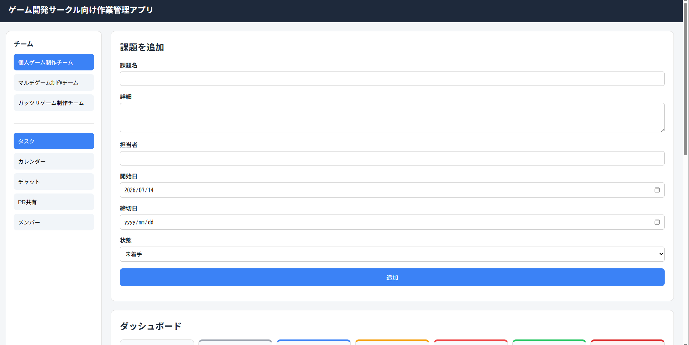
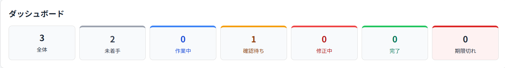
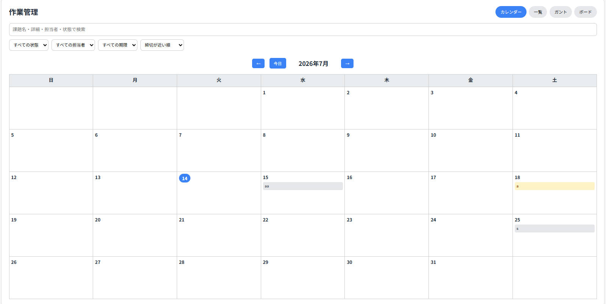
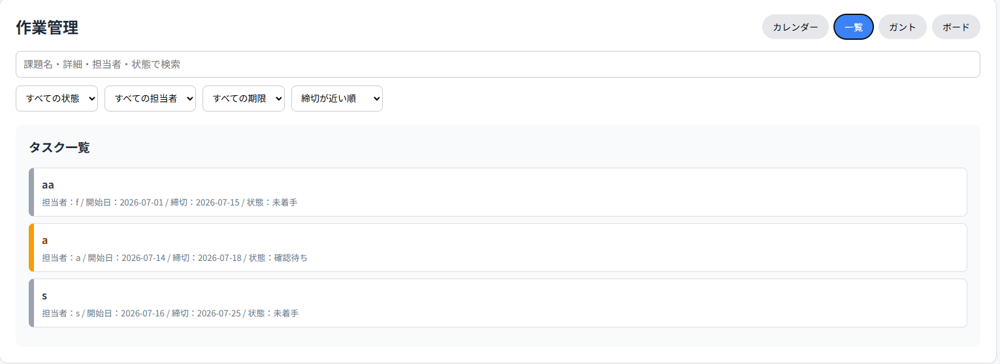
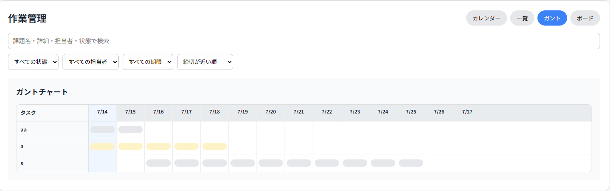
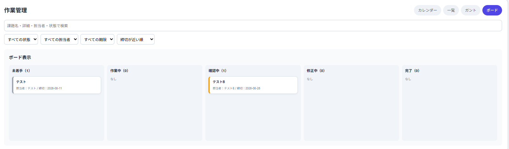
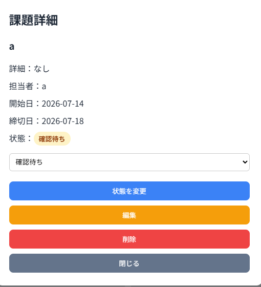

# ゲーム開発サークル向け作業管理Webアプリ

## 概要

ゲーム開発サークルでの実利用を想定して開発している、ゲーム制作チーム向けの作業管理Webアプリです。

ゲーム制作では、プログラマー、デザイナー、サウンド担当、シナリオ担当、企画担当など、複数のメンバーが並行して作業を進めます。

そのため、チーム内で次の情報を分かりやすく共有する必要があります。

* 誰が担当しているか
* 何を作業しているか
* いつから作業するか
* いつまでに完了させるか
* 現在どの進捗状態にあるか
* 期限を過ぎていないか
* 確認や修正が必要なタスクはどれか

本アプリでは、タスクの登録、状態管理、カレンダー表示、一覧表示、ガントチャート、ボード表示、検索、絞り込み、並び替え、詳細確認、編集、削除を実装しています。

現在はHTML、CSS、JavaScript、localStorageを使用してフロントエンドのみで開発しています。

今後はReactへの移行後、Ruby on RailsとPostgreSQLを使用して、複数人で利用できるWebアプリへ発展させる予定です。

---

## 開発背景

所属しているゲーム開発サークルでは、Discord、GitHub、口頭での相談など、作業に関する情報が複数の場所に分散しやすいという課題があります。

作業数や参加メンバーが増えると、次のような問題が発生します。

* 誰がどの作業を担当しているか分かりにくい
* タスクの開始日や締切を把握しにくい
* 未着手、作業中、確認待ち、修正中などの進捗を共有しにくい
* 期限切れのタスクに気づきにくい
* GitHubのPull Request確認依頼が流れやすい
* 画像、音声、仕様書などの制作資料が分散する
* 複数のゲーム制作チームの作業を分けて管理しにくい

これらの情報を一か所にまとめ、ゲーム制作チームが作業状況を確認しやすくすることを目的として開発を始めました。

---

## 想定している利用者

ゲーム開発サークルに所属する、次のような役割のメンバーを想定しています。

* プログラマー
* 2D・3Dデザイナー
* UIデザイナー
* サウンド担当
* シナリオ担当
* 企画担当
* ディレクター
* テスト担当

複数のゲーム制作チームが同時に活動している環境でも利用できるアプリを目指しています。

---

## アプリ画面

### メイン画面



画面左側にチーム・メニューのサイドバー、中央にタスク追加フォーム、ダッシュボード、作業管理画面を配置しています。

### ダッシュボード



タスク全体の件数に加えて、状態ごとの件数と期限切れ件数を表示します。

### カレンダー



タスクの締切日を月間カレンダー上で確認できます。

### タスク一覧



担当者、開始日、締切日、状態を一覧で確認できます。

### ガントチャート



開始日から締切日までの作業期間を14日分のガントチャートで表示します。

### ボード



未着手、作業中、確認待ち、修正中、完了の列にタスクを分けて表示します。

### タスク詳細モーダル



タスクをクリックすると、詳細情報の確認、状態変更、編集、削除を行えます。

---

## 使用技術

### 現在使用している技術

* HTML
* CSS
* JavaScript
* ES Modules
* localStorage
* JSON

### 開発環境

* Visual Studio Code
* Live Server
* Git
* GitHub

### 今後使用予定の技術

* React
* Ruby on Rails
* PostgreSQL
* GitHub API
* Renderなどのデプロイサービス

---

## 現在のデータ構造

タスクは次のようなオブジェクトとして管理しています。

```js
const task = {
  id: Date.now(),
  title: "敵AIの実装",
  description: "索敵と追跡処理を作成する",
  assignee: "山田",
  createdAt: "2026-07-10",
  deadline: "2026-07-20",
  status: "working"
};
```

各プロパティの役割は次のとおりです。

| プロパティ         | 内容         |
| ------------- | ---------- |
| `id`          | タスクを識別するID |
| `title`       | タスク名       |
| `description` | タスクの詳細     |
| `assignee`    | 担当者        |
| `createdAt`   | 作業開始日      |
| `deadline`    | 締切日        |
| `status`      | 現在の進捗状態    |

`createdAt`という名前は初期実装の名残で、現在は作業開始日として使用しています。

将来的には、データ構造を整理する際に`startDate`へ変更する予定です。

---

## タスク状態

タスクは次の5つの状態で管理しています。

| 値         | 表示名  |
| --------- | ---- |
| `todo`    | 未着手  |
| `working` | 作業中  |
| `review`  | 確認待ち |
| `fix`     | 修正中  |
| `done`    | 完了   |

以前は`completed`による完了・未完了の2状態だけでしたが、ゲーム制作の進捗をより細かく表現するため、`status`へ変更しました。

```js
export const STATUS_LIST = [
  { value: "todo", label: "未着手" },
  { value: "working", label: "作業中" },
  { value: "review", label: "確認待ち" },
  { value: "fix", label: "修正中" },
  { value: "done", label: "完了" }
];
```

---

# 実装済み機能

## 1. タスク追加機能

次の情報を入力してタスクを登録できます。

* タスク名
* 詳細
* 担当者
* 開始日
* 締切日
* 状態

タスク名、開始日、締切日は必須項目です。

```js
if (
  taskInput.title === "" ||
  taskInput.startDate === "" ||
  taskInput.deadline === ""
) {
  return "課題名、開始日、締切日は必須です";
}
```

開始日が締切日より後の場合も、エラーを表示します。

```js
if (taskInput.startDate > taskInput.deadline) {
  return "開始日は締切日より前の日付にしてください";
}
```

登録後は入力内容をリセットし、カレンダー、一覧、ガントチャート、ボード、ダッシュボードを再描画します。

---

## 2. localStorageによるデータ保存

登録したタスクは、ブラウザのlocalStorageへ保存しています。

```js
export function saveTasks() {
  localStorage.setItem("tasks", JSON.stringify(tasks));
}
```

JavaScriptの配列やオブジェクトはそのままlocalStorageへ保存できないため、`JSON.stringify()`を使用してJSON文字列へ変換しています。

読み込み時には`JSON.parse()`で配列へ戻します。

```js
function loadTasks() {
  const savedTasks = localStorage.getItem("tasks");

  if (!savedTasks) {
    return [];
  }

  return JSON.parse(savedTasks);
}
```

これにより、ブラウザを更新しても登録したタスクが残ります。

---

## 3. 旧データの変換処理

以前は`completed`という真偽値で完了状態を管理していました。

現在は`status`へ変更していますが、過去のlocalStorageデータをそのまま読み込めるよう、起動時にデータを変換しています。

```js
if (!task.status) {
  task.status = task.completed === true
    ? "done"
    : "todo";
}

delete task.completed;
```

仕様変更後も以前のデータを利用できるようにしている点が特徴です。

---

## 4. ダッシュボード機能

ダッシュボードでは次の件数を表示します。

* 全タスク
* 未着手
* 作業中
* 確認待ち
* 修正中
* 完了
* 期限切れ

```js
todoCount.textContent = tasks.filter(function (task) {
  return task.status === "todo";
}).length;
```

各カードをクリックすると、対応する状態のタスクだけに絞り込めます。

例えば「作業中」のカードをクリックすると、状態フィルターが`working`に変更されます。

```js
workingCard.addEventListener("click", function () {
  onFilterChange({
    status: "working",
    deadline: "all"
  });
});
```

---

## 5. カレンダー表示

月間カレンダー上に、タスクの締切日を表示します。

以前は開始日から締切日までをカレンダー上に期間バーとして表示していましたが、タスクが増えると見づらくなるため、カレンダーでは締切日のみを表示する仕様へ変更しました。

```js
if (dateString !== task.deadline) {
  return;
}
```

期限切れのタスクには警告マークを付け、赤色で表示します。

```js
taskButton.textContent = expired
  ? "⚠ " + task.title
  : task.title;
```

今日の日付は青い丸で強調表示しています。

---

## 6. タスク一覧表示

タスクを一覧形式で表示します。

一覧では次の情報を確認できます。

* タスク名
* 担当者
* 開始日
* 締切日
* 状態
* 期限切れ

```js
meta.textContent =
  "担当者：" +
  getTaskAssignee(task) +
  " / 開始日：" +
  task.createdAt +
  " / 締切：" +
  task.deadline +
  " / 状態：" +
  getStatusLabel(task.status);
```

一覧のタスクをクリックすると、詳細モーダルを表示します。

---

## 7. ガントチャート

タスクの開始日から締切日までを、14日分のガントチャートで表示します。

```js
const isInRange =
  dateString >= task.createdAt &&
  dateString <= task.deadline;
```

タスクの状態に応じてバーの色を変更します。

また、今日の日付の列を強調表示し、現在の日付との位置関係を把握しやすくしています。

---

## 8. ボード表示

タスクを次の状態ごとに列分けして表示します。

* 未着手
* 作業中
* 確認待ち
* 修正中
* 完了

各列の見出しには、その状態にあるタスク数も表示します。

```js
heading.textContent =
  status.label + "（" + statusTasks.length + "）";
```

ボード上のタスクカードはドラッグできます。

別の状態の列へドロップすると、タスクの`status`が更新されます。

```js
targetTask.status = column.dataset.status;

saveTasks();
onTaskChange();
```

状態変更後はlocalStorageへ保存し、すべての画面へ反映します。

---

## 9. 検索機能

検索欄から、次の内容を検索できます。

* タスク名
* 詳細
* 担当者
* 状態名

```js
return (
  title.includes(keyword) ||
  description.includes(keyword) ||
  assignee.includes(keyword) ||
  statusLabel.includes(keyword)
);
```

検索結果はカレンダー、一覧、ガントチャート、ボードのすべてに反映されます。

---

## 10. フィルター機能

次の条件でタスクを絞り込めます。

### 状態

* すべて
* 未着手
* 作業中
* 確認待ち
* 修正中
* 完了

### 担当者

登録済みタスクから担当者名を取得し、選択肢を自動生成します。

```js
tasks.forEach(function (task) {
  const assigneeName = getTaskAssignee(task);

  if (!assignees.includes(assigneeName)) {
    assignees.push(assigneeName);
  }
});
```

### 期限

* すべて
* 期限切れのみ
* 今日締切のみ

複数のフィルターと検索条件を同時に利用できます。

---

## 11. 並び替え機能

タスクの表示順を変更できます。

* 締切が近い順
* 開始日が早い順
* タスク名順
* 担当者順
* 状態順

```js
if (selectedSort === "deadline") {
  return a.deadline.localeCompare(b.deadline);
}
```

状態順の場合は、状態ごとに数値を割り当てて並び替えています。

```js
export const STATUS_ORDER = {
  todo: 1,
  working: 2,
  review: 3,
  fix: 4,
  done: 5
};
```

---

## 12. 期限切れ判定

締切日が今日より前で、状態が完了ではないタスクを期限切れとしています。

```js
export function isTaskExpired(task) {
  return (
    task.deadline < getTodayString() &&
    task.status !== "done"
  );
}
```

期限切れタスクは、カレンダー、一覧、ガントチャート、ボードで赤く表示します。

---

## 13. タスク詳細モーダル

カレンダー、一覧、ガントチャート、ボードのタスクをクリックすると、詳細モーダルを表示します。

表示する情報は次のとおりです。

* タスク名
* 詳細
* 担当者
* 開始日
* 締切日
* 状態

モーダルから状態変更、編集、削除を行えます。

以前は画面右側に詳細パネルを固定表示していましたが、作業管理画面を広く使うため、モーダル形式へ変更しました。

---

## 14. 状態変更機能

詳細モーダル内のセレクトボックスから、タスクの状態を変更できます。

```js
task.status = statusSelect.value;

saveTasks();
onTaskChange();
```

状態変更後は、ダッシュボード、カレンダー、一覧、ガントチャート、ボードへ即座に反映されます。

---

## 15. 編集機能

編集画面では次の情報を変更できます。

* タスク名
* 詳細
* 担当者
* 開始日
* 締切日
* 状態

保存前に、必須入力と日付の前後関係を確認します。

```js
if (editedStartDate > editedDeadline) {
  alert("開始日は締切日より前の日付にしてください");
  return;
}
```

保存後はlocalStorageへ反映し、各画面を再描画します。

---

## 16. 削除機能

削除前に確認ダイアログを表示します。

```js
const ok = confirm("この課題を削除しますか？");

if (!ok) {
  return;
}
```

削除処理では、対象以外のタスクを残した新しい配列を作成します。

```js
export function deleteTask(taskId) {
  tasks = tasks.filter(function (task) {
    return task.id !== taskId;
  });

  saveTasks();
}
```

---

## 17. 表示切り替え

作業管理画面では、次の4種類の表示を切り替えられます。

* カレンダー
* 一覧
* ガント
* ボード

表示対象以外へ`hidden`クラスを付けることで切り替えています。

```js
calendarArea.classList.add("hidden");
listArea.classList.add("hidden");
ganttArea.classList.add("hidden");
boardArea.classList.add("hidden");
```

---

# JavaScriptのファイル構成

機能追加によって`todorist.js`が大きくなったため、現在はES Modulesを使用して機能ごとにファイルを分割しています。

```text
js/
├─ data.js
├─ filters.js
├─ modal.js
├─ calendar.js
├─ gantt.js
├─ board.js
├─ taskList.js
├─ dashboard.js
└─ form.js
```

## 各ファイルの役割

| ファイル           | 役割                      |
| -------------- | ----------------------- |
| `data.js`      | タスクデータ、保存、読込、追加、削除、日付処理 |
| `filters.js`   | 検索、絞り込み、並び替え、期限切れ判定     |
| `modal.js`     | タスク詳細、状態変更、編集、削除        |
| `calendar.js`  | カレンダー描画                 |
| `gantt.js`     | ガントチャート描画               |
| `board.js`     | ボード描画、ドラッグによる状態変更       |
| `taskList.js`  | タスク一覧描画                 |
| `dashboard.js` | 状態別件数表示、カードクリック処理       |
| `form.js`      | タスク追加フォーム、入力検証          |
| `todorist.js`  | 各モジュールの接続、画面切り替え、初期化    |

メインとなる`todorist.js`には、各機能を接続する処理を残しています。

```js
import { renderCalendar } from "./js/calendar.js";
import { renderGanttChart } from "./js/gantt.js";
import { renderBoard } from "./js/board.js";
import { renderTaskList } from "./js/taskList.js";
```

機能ごとに責務を分けることで、コードを探しやすくし、Reactへ移行しやすい構成を意識しています。

---

# UI改善

## 左サイドバー

画面左側にチーム選択とメニューを配置しています。

現在表示しているチーム名はダミーですが、今後のチーム機能を想定したUIです。

* 個人ゲーム制作チーム
* マルチゲーム制作チーム
* ガッツリゲーム制作チーム

メニューには次の項目を配置しています。

* タスク
* カレンダー
* チャット
* PR共有
* メンバー

未実装の項目もありますが、最終的な画面構成を想定して配置しています。

## 詳細パネルのモーダル化

以前は右側にタスク詳細パネルを表示していました。

しかし、カレンダーやガントチャートの表示領域が狭くなってしまったため、詳細表示をモーダルへ変更しました。

これにより、通常時は作業管理画面を広く使用できます。

## 状態による色分け

未着手、作業中、確認待ち、修正中、完了を、それぞれ異なる色で表示しています。

これにより、文字を読まなくても現在の状態を視覚的に判断できます。

---

# 工夫した点

## 1. 実際のゲーム制作を想定した状態設計

一般的な完了・未完了だけでなく、ゲーム制作で発生しやすい次の状態を用意しました。

* 未着手
* 作業中
* 確認待ち
* 修正中
* 完了

実装後のレビューや修正まで含めて管理できるようにしています。

## 2. 目的ごとに表示方法を分けた点

同じタスクデータを、目的に応じて4種類の画面で表示しています。

* カレンダー：締切日を確認する
* 一覧：詳細情報を順番に確認する
* ガント：作業期間を確認する
* ボード：状態別に進捗を確認する

表示方法を切り替えることで、必要な情報を確認しやすくしています。

## 3. 検索と複数フィルターを組み合わせられる点

検索、状態、担当者、期限、並び替えを同時に利用できます。

例えば、次のような絞り込みが可能です。

```text
担当者：山田
状態：作業中
期限：期限切れ
検索：敵
```

タスク数が増えた場合でも、必要なタスクを探しやすい構成にしています。

## 4. すべての画面で同じデータを利用している点

タスクデータを変更した後は、各画面を再描画します。

```js
function refreshAllViews() {
  renderAssigneeFilterOptions();
  renderDashboard(tasks);
  drawCalendar();
  drawTaskList();
  drawGanttChart();
  drawBoard();
}
```

状態変更や編集内容が、一部の画面にしか反映されない問題を防いでいます。

## 5. 古いデータとの互換性を残した点

状態管理を`completed`から`status`へ変更した後も、以前保存したデータを読み込めるように変換処理を用意しました。

アプリの仕様変更時に、保存済みデータを壊さないことを意識しています。

## 6. 機能ごとにJavaScriptを分割した点

すべての処理を1ファイルに書くと、修正箇所を探しにくくなります。

そのため、データ、検索、モーダル、カレンダー、ガントチャート、ボードなど、役割ごとにファイルを分割しました。

React化する際にも、現在の各ファイルをコンポーネントやユーティリティへ対応させやすくなります。

---

# 技術的に学んだこと

本アプリの制作を通して、次の内容を学びました。

* DOM操作
* `getElementById()`による要素取得
* `createElement()`による要素生成
* `appendChild()`による要素追加
* `addEventListener()`によるイベント処理
* 配列とオブジェクトを使用したデータ管理
* `forEach()`による繰り返し処理
* `find()`によるデータ検索
* `filter()`による絞り込みと削除
* `sort()`による並び替え
* `slice()`による配列コピー
* `includes()`による部分一致検索
* `localeCompare()`による文字列並び替え
* localStorageによるデータ保存
* `JSON.stringify()`と`JSON.parse()`によるデータ変換
* 日付文字列の比較
* ドラッグ＆ドロップ処理
* CSS Grid
* Flexbox
* モーダルUI
* 状態に応じたクラス付与
* ES Modules
* `import`と`export`
* 機能単位のファイル分割
* コールバック関数によるモジュール間連携
* 旧データを新しい形式へ変換するマイグレーション処理

---

# 現在の課題

## localStorageのみで保存している

現在のデータは、使用しているブラウザ内にのみ保存されます。

そのため、別のPCや他のメンバーとデータを共有できません。

## チーム機能は未実装

サイドバーにチーム名を表示していますが、現在はダミーです。

タスクデータには、まだチーム情報を保存していません。

## コメント・添付・PR共有は未実装

UI上にはメニューを配置していますが、コメント、ファイル添付、GitHub Pull Request共有は未実装です。

## ユーザー認証がない

現在はログイン機能やユーザー管理機能がありません。

## スマートフォン表示の調整が不十分

基本的なレスポンシブ対応はありますが、カレンダー、ガントチャート、ボードのスマートフォン表示には改善の余地があります。

---

# 今後の開発予定

## 1. React化

現在のHTML、CSS、JavaScript版のUIと主要機能が固まった後、Reactへ移行します。

現在のファイル構成を、次のようなコンポーネントへ対応させる予定です。

```text
App
├─ Header
├─ Sidebar
├─ TaskForm
├─ Dashboard
├─ SearchFilter
├─ Calendar
├─ TaskList
├─ GanttChart
├─ Board
└─ TaskModal
```

React化後は、`useState`を使用してタスクやフィルター状態を管理します。

## 2. チーム管理

タスクにチーム情報を追加します。

```js
{
  groupId: "team-1"
}
```

サイドバーでチームを切り替えると、そのチームに所属するタスクだけを表示する予定です。

## 3. 通知機能

次のようなタスクを通知として表示します。

* 今日が締切のタスク
* 期限切れタスク
* 確認待ちタスク
* 修正依頼があるタスク

## 4. コメント機能

タスクごとにコメントを投稿できるようにします。

想定している利用例は次のとおりです。

```text
山田：
修正しました。確認をお願いします。

田中：
動作確認後にマージします。
```

## 5. ファイル添付

ゲーム制作で使用する次のファイルをタスクへ添付できるようにします。

* 画像
* 音声
* PDF
* 仕様書
* スクリーンショット
* 動画
* Unity関連ファイル

## 6. GitHub Pull Request共有

Pull Requestの情報をタスクへ紐づけられるようにします。

想定している情報は次のとおりです。

* Pull RequestのURL
* タイトル
* 変更内容
* レビューしてほしい点
* レビュー状態
* スクリーンショット

最初は手動入力で実装し、将来的にはGitHub APIとの連携を検討します。

## 7. Ruby on RailsとPostgreSQLによるバックエンド化

React化後、Rails APIとPostgreSQLを使用して複数人で利用できるようにします。

想定しているテーブルは次のとおりです。

```text
users
groups
group_members
tasks
comments
attachments
pull_requests
notifications
```

ログインしたユーザーが、所属チームのタスクを確認・編集できる仕組みを作る予定です。

## 8. 公開

最終的には次の対応を行い、ポートフォリオとして公開します。

* レスポンシブ対応
* READMEの更新
* スクリーンショット追加
* 操作GIF追加
* GitHubリポジトリ整理
* フロントエンドのデプロイ
* Rails APIのデプロイ
* PostgreSQL接続

---

# 使い方

1. タスク名、詳細、担当者、開始日、締切日、状態を入力する
2. 追加ボタンを押してタスクを登録する
3. ダッシュボードで状態ごとの件数を確認する
4. カレンダーで締切日を確認する
5. 一覧で担当者、開始日、締切日、状態を確認する
6. ガントチャートで作業期間を確認する
7. ボードで状態ごとのタスクを確認する
8. ボード上のカードをドラッグして状態を変更する
9. 検索欄からタスクを検索する
10. 状態、担当者、期限で絞り込む
11. 表示順を変更する
12. タスクをクリックして詳細を確認する
13. 詳細モーダルから状態変更、編集、削除を行う

---

# 起動方法

本アプリではES Modulesを使用しているため、HTMLファイルを直接ダブルクリックするのではなく、ローカルサーバーから起動する必要があります。

Visual Studio Codeでは、Live Serverを利用できます。

```text
1. Visual Studio Codeでプロジェクトを開く
2. index.htmlを右クリックする
3. Open with Live Serverを選択する
```

次のようなURLで開けば起動できます。

```text
http://127.0.0.1:5500/
```

---

# まとめ

本アプリは、ゲーム開発サークルで発生するタスクや進捗情報を一元管理するために開発しているWebアプリです。

現在は、次の機能を実装しています。

* タスク追加
* 開始日・締切日管理
* 5段階の状態管理
* localStorage保存
* ダッシュボード
* カレンダー
* タスク一覧
* ガントチャート
* Trello風ボード
* ドラッグによる状態変更
* 検索
* 状態フィルター
* 担当者フィルター
* 期限フィルター
* 並び替え
* 詳細モーダル
* 状態変更
* 編集
* 削除
* JavaScriptのモジュール分割

今後はReact化を行った後、チーム管理、通知、コメント、ファイル添付、Pull Request共有を追加します。

最終的にはRuby on RailsとPostgreSQLを使用し、ゲーム開発サークルの複数メンバーが実際に利用できる作業管理Webアプリへ発展させることを目標としています。
