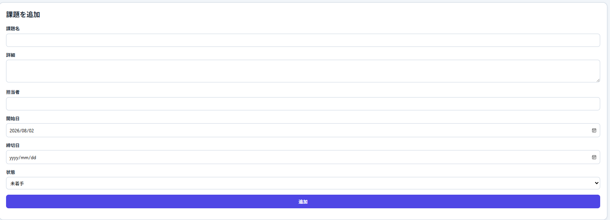
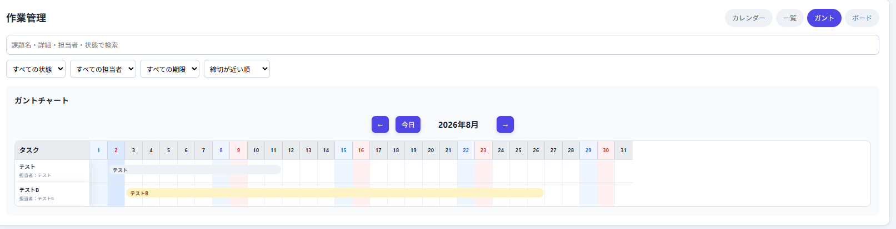
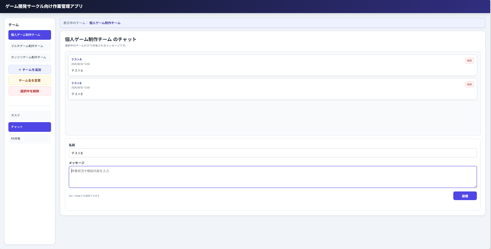
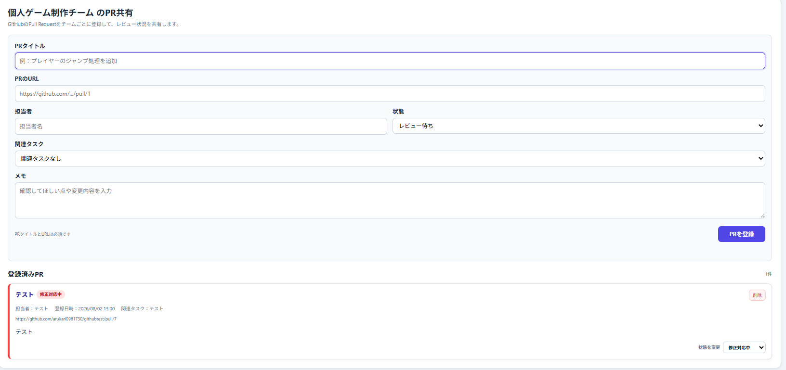
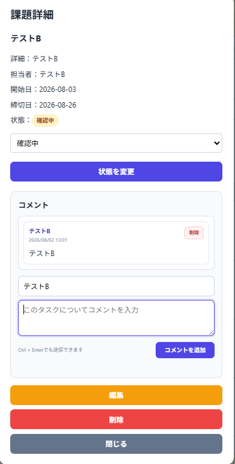

# ゲーム開発サークル向け作業管理アプリ

ゲーム制作チームのタスク・進捗・情報共有を、1つの画面で管理するWebアプリです。

タスクの登録や編集だけでなく、カレンダー、一覧、ガントチャート、カンバンボードなど、複数の形式で進捗を確認できます。  
また、チームごとのタスク管理、チャット、タスクコメント、Pull Request共有にも対応しています。

---

## 目次

- [開発背景](#開発背景)
- [アプリの目的](#アプリの目的)
- [主な機能](#主な機能)
- [画面紹介](#画面紹介)
- [使用技術](#使用技術)
- [ファイル構成](#ファイル構成)
- [データ管理](#データ管理)
- [使い方](#使い方)
- [実装上の工夫](#実装上の工夫)
- [苦労した点と解決方法](#苦労した点と解決方法)
- [現在の制限](#現在の制限)
- [今後の予定](#今後の予定)
- [起動方法](#起動方法)

---

## 開発背景

ゲーム制作では、プログラム、デザイン、サウンドなど、複数の担当者が並行して作業を進めます。

しかし、タスクの担当者や締切、進捗状況が分散すると、次のような問題が発生します。

- 誰が何を担当しているのか分かりにくい
- 締切や作業期間を把握しにくい
- チームごとの情報が混ざる
- 作業の相談やレビュー状況を追いにくい
- タスク管理、チャット、GitHubの情報を別々に確認する必要がある

そこで、ゲーム制作サークル内での利用を想定し、作業管理と情報共有を1つにまとめたWebアプリを開発しました。

---

## アプリの目的

このアプリでは、次の状態を目指しています。

- チームごとに作業を分けて管理できる
- タスクの担当者、状態、開始日、締切日を確認できる
- 用途に応じて表示形式を切り替えられる
- タスクに関する相談や進捗を記録できる
- Pull Requestのレビュー状況をチーム内で共有できる
- 必要な情報を一か所で確認できる

---

## 主な機能

### チーム管理

- チームの追加
- チーム名の変更
- チームの削除
- 選択中チームの切り替え
- チームごとのデータ分離
- 選択中チームのLocalStorage保存

チームを切り替えると、そのチームに所属するタスク、チャット、コメント、PR共有だけが表示されます。

### タスク管理

- タスク追加
- タスク詳細表示
- タスク編集
- タスク削除
- 担当者設定
- 開始日・締切日設定
- ステータス変更
- 入力チェック
- LocalStorageによる永続化

ステータスは次の5種類です。

| 状態 | 説明 |
|---|---|
| 未着手 | まだ作業を開始していない |
| 作業中 | 現在作業している |
| 確認中 | レビューや動作確認を待っている |
| 修正中 | 指摘内容を修正している |
| 完了 | 作業が完了している |

### ダッシュボード

選択中チームのタスク件数を、状態別に表示します。

- 全体
- 未着手
- 作業中
- 確認中
- 修正中
- 完了
- 期限切れ

カードをクリックすると、対応する条件で絞り込んだ一覧画面へ移動します。

### カレンダー表示

- 月単位のカレンダー
- 前月・次月への移動
- 今日の月へ戻る
- 締切日にタスクを表示
- 土曜日・日曜日の色分け
- 今日の日付の強調
- タスククリックで詳細表示

カレンダーでは、作業期間を毎日表示せず、締切日にタスクを表示することで情報量を抑えています。

### タスク一覧

- カード形式で表示
- タイトル
- 詳細
- 担当者
- 開始日
- 締切日
- ステータス
- 期限切れ表示
- クリックによる詳細表示

### ガントチャート

- 表示中の月だけを描画
- 開始日から締切日までを横棒で表示
- 月をまたぐタスクに対応
- 前月・次月への移動
- 今日の月へ戻る
- 土曜日・日曜日の色分け
- 今日の列を強調
- 横スクロール対応

月をまたぐタスクは、表示中の月に該当する部分だけを表示します。

例：

- 開始日：7月23日
- 締切日：8月24日

7月表示では「7月23日から7月31日」、8月表示では「8月1日から8月24日」を表示します。

### カンバンボード

次の5列でタスクを表示します。

- 未着手
- 作業中
- 確認中
- 修正中
- 完了

タスクカードをドラッグ＆ドロップすることでステータスを変更でき、変更内容はLocalStorageへ保存されます。

### 検索・フィルター・並び替え

検索対象：

- タイトル
- 詳細
- 担当者
- 状態
- 開始日
- 締切日

フィルター：

- ステータス
- 担当者
- 期限

並び替え：

- 締切日
- 開始日
- タイトル
- 担当者
- ステータス

### チームチャット

- チームごとのメッセージ保存
- 名前と本文の入力
- 投稿日時の表示
- メッセージ削除
- `Ctrl + Enter` による送信
- LocalStorageへの保存

現在のチャットは、同じブラウザ内で利用するLocalStorage版です。

### タスクコメント

- タスクごとのコメント保存
- 投稿者名
- コメント本文
- 投稿日時
- コメント削除
- `Ctrl + Enter` による投稿
- タスク詳細モーダル内に表示

チーム全体のチャットとは別に、個別タスクに関する相談や進捗メモを残せます。

### PR共有

GitHubのPull Request情報を、チームごとに登録して共有できます。

登録項目：

- PRタイトル
- PRのURL
- 担当者
- 状態
- 関連タスク
- メモ

PRの状態：

- 下書き
- レビュー待ち
- 修正対応中
- マージ済み
- クローズ

現在はGitHub APIを使用せず、手動登録する方式です。

---

## 画面紹介

> 画像はリポジトリ内の `images` フォルダへ配置してください。

### タスク追加・チーム管理



チームの追加・変更・削除と、タスクの新規登録を行います。

### カレンダー


選択中チームのタスクを締切日ごとに表示します。

### タスク一覧


タスクの詳細や担当者、期間、状態をカード形式で確認できます。

### ガントチャート



タスクの開始日から締切日までの期間を、月単位で可視化します。

### カンバンボード


タスクを状態別に表示し、ドラッグ＆ドロップで移動できます。

### チームチャット



選択中チーム内の作業状況や相談内容を記録できます。

### PR共有



Pull RequestのURL、担当者、レビュー状況、関連タスクを共有できます。

### タスク詳細・コメント



タスクの状態変更、編集、削除、コメント投稿を行えます。

---

## 使用技術

| 分類 | 使用技術 |
|---|---|
| フロントエンド | HTML |
| スタイル | CSS |
| プログラム | JavaScript |
| モジュール管理 | ES Modules |
| データ保存 | LocalStorage |
| バージョン管理 | Git / GitHub |

フレームワークや外部ライブラリを使わず、JavaScriptの標準機能を中心に実装しています。

---

## ファイル構成

```text
project
├── todorist.html
├── todorist.css
├── todorist.js
│
├── images
│   ├── task-form.png
│   ├── calendar.png
│   ├── task-list.png
│   ├── gantt.png
│   ├── board.png
│   ├── chat.png
│   ├── pr-sharing.png
│   └── task-detail.png
│
└── js
    ├── appState.js
    ├── board.js
    ├── calendar.js
    ├── chat.js
    ├── chatData.js
    ├── dashboard.js
    ├── data.js
    ├── filterControls.js
    ├── filters.js
    ├── form.js
    ├── gantt.js
    ├── mainMenu.js
    ├── modal.js
    ├── navigation.js
    ├── prData.js
    ├── prSharing.js
    ├── taskCommentData.js
    ├── taskComments.js
    ├── taskList.js
    ├── teamControls.js
    ├── teams.js
    └── viewRenderer.js
```

---

## 各JavaScriptファイルの役割

| ファイル | 主な役割 |
|---|---|
| `todorist.js` | アプリ全体の初期化 |
| `appState.js` | 現在の画面と表示月の管理 |
| `data.js` | タスクの保存・読込・追加・更新・削除 |
| `teams.js` | チームデータと選択中チームの管理 |
| `teamControls.js` | チーム一覧と追加・変更・削除操作 |
| `form.js` | タスク追加フォーム |
| `dashboard.js` | 状態別件数の集計と表示 |
| `calendar.js` | カレンダーの生成 |
| `taskList.js` | タスク一覧の生成 |
| `gantt.js` | ガントチャートの生成 |
| `board.js` | カンバンボードとドラッグ操作 |
| `filters.js` | 検索・フィルター・並び替え |
| `filterControls.js` | フィルターUIのイベント管理 |
| `modal.js` | タスク詳細・編集・削除モーダル |
| `navigation.js` | カレンダー・一覧・ガント・ボード切り替え |
| `viewRenderer.js` | 現在の画面を判定して各描画処理を呼び出す |
| `mainMenu.js` | タスク・チャット・PR共有画面の切り替え |
| `chatData.js` | チャットデータの保存・読込 |
| `chat.js` | チャット画面の描画と送信操作 |
| `taskCommentData.js` | タスクコメントの保存・読込 |
| `taskComments.js` | タスクコメントUI |
| `prData.js` | PR共有データの保存・読込 |
| `prSharing.js` | PR登録フォームと一覧表示 |

---

## データ管理

### タスクデータ

```javascript
{
  id: 1721700000000,
  teamId: "team-1721699999999",
  title: "プレイヤー移動処理",
  description: "左右移動とジャンプを実装する",
  assignee: "田中",
  createdAt: "2026-07-28",
  deadline: "2026-08-07",
  status: "working"
}
```

### チームデータ

```javascript
{
  id: "team-1721699999999",
  name: "アクションゲーム制作チーム"
}
```

各データに `teamId` を持たせることで、選択中チームの情報だけを表示します。

---

## 使い方

1. サイドバーの「チームを追加」からチームを作成する
2. チーム名をクリックして、作業対象のチームを選択する
3. 課題名、詳細、担当者、開始日、締切日、状態を入力してタスクを追加する
4. カレンダー、一覧、ガント、ボードから表示形式を選ぶ
5. タスクをクリックして、状態変更、編集、削除、コメント投稿を行う
6. サイドバーの「チャット」からチーム内のメッセージを記録する
7. 「PR共有」からPull Request情報を登録する

---

## 実装上の工夫

### 1. JavaScriptの責務を分割

1つのJavaScriptファイルへすべての処理を書くのではなく、機能ごとにモジュールを分割しました。

これにより、修正対象を探しやすくし、1つの変更が他機能へ与える影響を抑えています。

### 2. 描画処理の共通化

`viewRenderer.js` を描画の司令塔とし、現在の画面に応じてカレンダー、一覧、ガント、ボードの処理を呼び分けています。

同じタスクデータを複数の表示形式で利用しています。

### 3. チームごとのデータ分離

タスク、チャット、コメント、PR共有にチームIDを持たせ、選択中チームのデータだけを表示しています。

### 4. 既存データの移行

チーム機能追加前のタスクには `teamId` がないため、既存タスクを初期チームへ自動的に所属させる処理を追加しました。

以前のデータを消さずに新しい仕様へ移行できます。

### 5. 月をまたぐガントチャート

表示月の月初と月末を求め、タスクの開始日・締切日と比較して、表示中の月に該当する範囲だけを描画しています。

### 6. 日付処理

`YYYY-MM-DD` 形式の文字列を安全に日付へ変換し、不正な値を除外しています。

ガントチャートの日数計算ではUTCを使用し、時刻の影響による日数計算のずれを防いでいます。

### 7. 操作性への配慮

- 入力必須項目のチェック
- 開始日と締切日の前後関係チェック
- 削除前の確認
- 最後の1チームを削除できない制御
- 空データ時のメッセージ表示
- モーダルのEscキー対応
- ガント・ボードの横スクロール
- 狭い画面でのレスポンシブ対応

---

## 苦労した点と解決方法

### HTML・CSS・JavaScriptの世代違い

開発途中で異なる時期のコードが混ざり、HTMLのIDやCSSのクラス名と、JavaScriptが取得する名前が一致しない問題が発生しました。

例：

- HTMLでは `calendarArea`
- JavaScriptでは `calendarView`
- CSSでは `.task-list-item`
- JavaScriptでは `.task-list-card`

各ファイルのID、クラス名、関数名を確認し、現行仕様へ統一することで解決しました。

### ガントチャートの月またぎ表示

開始月と終了月が異なるタスクで、バーの位置や長さが崩れる問題が発生しました。

表示月の範囲内に開始日と締切日を切り詰め、月初からの差分日数を使って位置を計算することで解決しました。

### 機能追加によるコード肥大化

安全性を意識して処理を追加し続けた結果、コード量が増え、修正時の影響範囲を追いにくくなりました。

その後、必要な処理を整理し、機能ごとの責務分割を優先して再構成しました。

現在は一度に大きく変更せず、変更対象を限定して動作確認しながら開発しています。

---

## 現在の制限

現在はLocalStorageを使用しているため、次の制限があります。

- データは利用中のブラウザに保存される
- 別の端末やブラウザとは共有できない
- 複数人でリアルタイムに同じデータを編集できない
- ログイン機能がない
- ユーザーごとの権限管理がない
- チャットはリアルタイム通信ではない
- PR情報はGitHubから自動取得されない

---

## 今後の予定

### フロントエンド

- Reactへの移行
- コンポーネント単位でのUI分割
- 状態管理の整理
- UI・UXの改善

### バックエンド

- Ruby on RailsによるAPI作成
- PostgreSQLによるデータ管理
- ユーザー登録・ログイン
- チーム招待
- 権限管理
- 複数端末でのデータ共有

### コミュニケーション

- WebSocketを使用したリアルタイムチャット
- 通知機能
- タスク更新履歴
- メンション機能

### GitHub連携

- GitHub APIによるPR自動取得
- Issueの表示
- コミット履歴の表示
- タスクとPRの連携強化

---

## 起動方法

ES Modulesを使用しているため、HTMLファイルを直接開くのではなく、ローカルサーバーから起動してください。

### Visual Studio Codeを使用する場合

1. プロジェクトをVisual Studio Codeで開く
2. Live Server拡張機能をインストール
3. `todorist.html` を右クリック
4. `Open with Live Server` を選択

### Pythonを使用する場合

プロジェクトフォルダで次を実行します。

```bash
python -m http.server 8000
```

ブラウザで次を開きます。

```text
http://localhost:8000/todorist.html
```

---

## 作者

情報系専門学校でWeb開発を学びながら、ゲーム制作サークルでの利用を想定して開発しています。

---

## リポジトリ

```text
https://github.com/arukari0961730/todorist
```
